# Building AWS AMI

::: header lang-en

| Product | AWS Automation   |
| ------- | ---------------- |
| Author  | Arwyn Hainsworth |
| Status  | 1.0              |

[[TOC]]

:::

## Overview

Building Amazon Machine Images (AMI) is a relatively simple task, but the lack of a standard method for doing so can cause unexpected complexities.

In essence all that is needed is to start up a base AMI, install software and create an AMI from the new setup.

Porters already uses a number of tools that can do this task, such as Chef and Packer, but these tools have additional features and add unneeded complexity.
These tools also fail to separate the task of preparation and the task of installation (detailed below). The permissions required for each task are different and the current infrastructure setup is such that they need to be separated.

The following specification outlines a process and tools to build AMIs that separate the 2 tasks and provide maximum code reuse.

## Goals and Non Goals

Goals
:   - Provide Process to Build AMIs
    - Must have minimal requirements (no packer or chef)
        + bash
        + python
        + awscli
    - Preparation Stage (access to source code) and Installation Stage (Access to Cloud) must be separate

Non-Goals
:   - Performance (Within Reason)
    - Cost (Within Reason)

## Architectural Design

### Stages

The process of Image Creation can be separated into the following stages. Some tools perform the Preparation Stage and Installation stage at the same time.

Preparation Stage (AKA Compilation Stage)
:   During this stage, the installation commands and files are bundled into executable form.

    All creation-time selections and choices are made during this stage and the resulting script (or command) can be copied to the temporary instance and executed without additional parameters.

    This stage needs access to any files or settings you wish to install on the instance, but it does not need access to the cloud.

    Note: application compile and build is not part of this stage. It is expected that the binaries are already available and all that is needed is installation.

Installation Stage
:   A temporary instance is started in the cloud, the prepared installation commands are executed and the instance is stopped.

    This stage needs access to cloud to start and stop the instance. It might also need to copy some larger files to temporary storage that the instance can access.

Image Creation Stage
:   Create an Image from the temporary instance, then remove the temporary instance.

    This stage needs access to the cloud to create images and remove the instance.

### Execution Environment

The current Jenkins executes slaves in 2 different scopes.

Local Scope
:   The slave has access to the local network, gerrit and any other local shared resources.

    Note: In this scope is is possible to access the AWS API, but is somewhat cumbersome to do it properly.

AWS Scope
:   The slave is run in the AWS account and has access to the VPC and AWS APIs.

By separating the preparation stage and the installation stage, we can run the preparation stage in the Local Scope and the Installation and Image Creation Stages in the AWS Scope.

While technically it is possible to run all stages in the local scope, separating them provides the following benefits:

1. Easier AWS Permission management.
    - In the AWS Scope we can get the permissions and keys from the instance role. In the Local Scope we need to use key and profiles, which makes things more complex.
1. Cloud Independence.
    - While not a goal of this project, the preparation stage is not inherently AWS dependant, so it can be re-used for Azure or AliBaba instance preparation.

The downside of separating the stages are minimal.

1. Added complexity of having separate scripts
    - The need to transfer the output of one script to another
1. The added complexity of having to prepare data before you have access to the image.
    - The Image developer needs an understanding of the instance life-cycles anyway, so this can be seen as a benefit as it forces the developer to think when he creates install scripts.

### Tools Used

The AWS CLI will be used for interaction with the AWS Cloud. Other Clouds are out of scope for now.

For the installation process we have 2 options:

SSH
:   This is what packer and chef use.

    It requires the instance to be accessible from the execution environment.

    Benefits
    :   - Interactive control (allows the preparation and installation to happen at same time)
        - Visible Output

    Negatives
    :   - Needs additional credentials (key-pairs) and some way to share them
        - Needs to be accessible from the execution environment
        - Can only be executed once temporary image has loaded

CloudInit
:   This is used by matching and is the Amazons suggested method for instance preparation.

    CloudInit is not an AWS technology. It is the "defacto multi-distribution package that handles early initialization of a cloud instance".

    It is available in centos / amazonlinux / ubuntu base images and known to work and is supported in AWS and Azure.

    It can integrate with cloud-formation and can be provided by the AWS CLI.

    Benefits
    :   - AWS recommended solution to the 'run command when instance starts' use case.
        - Does not need access to/from the execution environment
        - Full control over boot process

    Negatives
    :   - Commands are limited to 16k in size (compressed)
        - Output not visible (written to log file)
        - No interactive control
        - Need to learn settings file

While the SSH approach seems to have fewer negatives at first, the need to maintain keys for each AWS environment and the added complexity of maintaining the firewall settings can be a major issue.

The CloudInit approach negatives can be easily worked around:

- The size issue can be resolved by a temporary storage mechanism (HRBC does this anyway).
- The log file can be copied to an external storage mechanism if needed.
- CloudInit is needed to control the initial instance start-up from the image (e.g. to disable auto-update), so developers need to know how to use it anyway.

This makes the fact that it is the recommended approach and the fact the no additional key-pair/connection management is needed the deciding factors.

Conclusion: CloudInit will be used for installation stage.

### External Storage

The CloudInit data is limited to 16kb in size compressed. Since text compresses well, this is more than enough for most setting files and init scripts.

However application binaries are large and will not fit within the size limit. In these cases, a temporary storage mechanism is needed, that is accessible from the instance that the CloudInit is running on.

For AWS environments, S3 will be used. A tarball with all the filesystem changes will be prepared and stored on S3. The CloudInit will download, extract and optionally run an install script.

### Logging

CloudInit provides detailed control over the output logged. It can log to a file or to `rsyslog`.

The default just writes all output to `/var/log/cloud-init-output.log` with mode detailed logs in `/var/log/cloud-init.log`

If needed we can copy these files to S3 at the end of the install process.

## Detailed Design

### Preparation Stage

This stage needs the following:

1. Access to the AMI `source` directory.

This stage will perform the following operations:

1. Prepare the filesystem structure
1. Compile the configuration files and filesystem tarball to compressed CloudInit format

#### Preparation Stage - Script Name

build-create-image-userdata.sh - compiles userdata to create an Image

#### Preparation Stage - Script Synopsis

`build-create-image-userdata.sh` source target

#### Preparation Stage - Script Details

The `build-create-image-userdata.sh` script will take the `source` and generate 1~3 output files in the `target` directory.

1. `userdata.gz` - the compiled, compressed userdata
1. `fs.tgz` - if the filesystem was too large to fit in userdata, this will be left in the target directory.
1. `vars.env` - Bash environment variables used or generated during compilation.

#### Preparation Stage - Script Options

`source`
:   The path the AMI source. See the description of expected structure below.

`target`
:   Target directory to write output files to.

#### Preparation Stage - Script Environment Variables

`AWSREGION`
:   (Optional) AWS Region. Defaults to `ap-northeast-1`.

`S3URL`
:   (Required if S3 storage is needed) The S3 URL the `fs.tgz` will be uploaded to and can be download during AMI build.

    Should be in the `s3://<bucket>/path/to/fs.tgz` format.

#### Preparation Stage - External Storage

When the filesystem is larger than 8kb, then external storage is required to transfer the tarball.

Currently only S3 is supported. The `S3URL` environment variable must contain the full path where the `fs.tgz` file will be uploaded to and available as.

#### Preparation Stage - Source Layout

The preparation (compilation) and installation instructions should follow the following directory structure, with `Image-Source` indicating the image source root.

```plantuml
@startsalt

{{T
    + <&terminal> Image-Source
    ++ <&folder> cloudinit
    ++ <&folder> fs
    ++ <&folder> script
    +++ <&script> compile.sh
    +++ <&script> install.sh
    ++ <&file> ami.env
    ++ <&document> readme.md
}}

@endsalt
```



`cloudinit`
:   This directory contains the CloudInit `*.cfg` or `*.yml` files that will be merged and added to the temporary instance UserData.

    I.E. These are the installation commands. The will be run when the Temporary Instance is created and will not be present in the resulting Image.

    The name of these files should be sortable in the priority they intend to be executed. All files should start with 2 digits and an '_'. (E.G. `10_example.cfg`)

    Events
    :   The following events happen at following priorities:

        |Event|Priority|
        |---|---|
        | FS Download | 50 |
        | FS Extract | 51 |
        | Install.sh Exec | 51 |
        | Log Copy | 98 |
        | Shutdown | 99 |

    Implementation Note: CloudInit configuration files are in YML format, but need the `cfg` extension. To make development easier the compile script will rename the `yml` files during compilation. You can use either extension, but do not use the same file name.

`fs`
:   This directory contains files you wish to be present in resulting image.

    The file structure should be the same as the image root. (E.G. if you want to add a `/etc/cloud/cloud.cfg.d/99_do-not-update.cfg` to prevent the auto-update from running, you should put it in `fs/etc/cloud/cloud.cfg.d/99_do-not-update.cfg`)

    The files permission flags will be maintained, but the file ownership will be reset to `root`/`root`.

    The following locations are reserved and any files you put there will be overridden by the compile process:

    - `/var/run/fs.tgz`
    - `/var/run/install.sh`

    File download and extraction is done with generated cloudinit configurations that are located at priority 50 and 51 respectively.

`script`
:   This directory contains 2 _optional_ scripts that can be used to control the preparation and installation process.

    `compile.sh`
    :   This script is executed once a work folder has been prepared and populated.

        It is executed in the work folder context, which resembles the source structure, but is a copy of the original source with generated CloudInit configuration files.

        Use this file to download application binaries and install them in the files system. You may also add config files to the `cloudinit` directory at this stage.

        You do not have access to the `install.sh` script at this stage.

    `install.sh`
    :   If present, this script is added to the fs at `/var/run/install.sh`.

        When it is present, it will be executed after the FS has been extracted.

        The FS is extracted as `root`/`root`. If you need to change file ownership, this is the best place to do that.

`ami.env`
:   Metadata environment variables regarding the image.

    `NAME`
    : The name you wish to use for the image

    `VERSION`
    : The image version

    The scripts don't use this file directly, but you can use it when executing the scripts to commit metadata to the repository.

`readme.md`
:   Description of the image.

### Installation and Image Creation Stage

These stages need the following:

1. Access to AWS.
    1. Create, Modify, Terminate and Describe EC2 Instance
    1. Create and Describe EC2 AMI
    1. (Optional) Upload to S3
1. The compiled user-data
1. (Optional) The compiled filesystem tarball
1. (Optional) Variables used/generated during compilation (E.G. S3 URL the tarball needs to be uploaded to.)

During this stages, the `build/build-ami.sh` script will do the following:

1. (Optional) Upload filesystem tarball to S3
1. Create EC2 Instance with userdata attached
1. Wait for EC2 Instance to stop
1. Create AMI from Instance
1. Wait for AMI Creation to complete
1. Terminate EC2 Instance

The tarball is not deleted from S3. Please use the S3 life-cycle settings to ensure the file is removed.

The installation and AMI creation are done by the same script. This is so that we have more control over the temporary instance life-time. If we separate the scripts, it is more likely unterminated instances will be left around in case of problems during script execution.

#### Installation and Image Creation Stage - Script Name

build-ami.sh - runs userdata in instance, then builds an AMI from it

#### Installation and Image Creation Stage - Script Synopsis

```text
build-ami.sh [<USERDATA> [<TARGETNAME> [<TARGETVERSION>]]]
```

#### Installation and Image Creation Stage - Script Details

The `build-ami.sh` script will do the following:

1. (Optional) Upload filesystem tarball to S3
1. Create EC2 Instance with userdata attached
1. Wait for EC2 Instance to stop
1. Create AMI from Instance
1. Wait for AMI Creation to complete
1. Terminate EC2 Instance

#### Installation and Image Creation Stage - Script Options

None

#### Installation and Image Creation Stage - Script Environment Variables

The following environment variables are required:

BUILDAMI_BASEAMI
:   The Base AMI

BUILDAMI_SECURITYGROUPS
:   The Security Group Ids

BUILDAMI_PROFILE
:   The IAM Instance Profile

BUILDAMI_SUBNET
:   The Subnet ID

The following environment variables may be used instead of the arguments.
Either the arguments or these environment variables must be specified.

BUILDAMI_USERDATA
:   Path to the userdata file

BUILDAMI_TARGETNAME
:   AMI Name

BUILDAMI_TARGETVERSION
:   AMI Version

The following environment variables are optional:

BUILDAMI_TYPE
:   The instance type to use.  
    Default: t3.nano

BUILDAMI_TARGETDESCRIPTION
:   The description of the AMI.  
    Default: Generated from name and version.

BUILDAMI_KEYPAIR
:   The KeyName Pair to use.  
    Default: none.

BUILDAMI_OUTPUT
:   File to write resulting ami info to.  
    Default: none.

BUILDAMI_TIMEOUT_INSTANCE
:   Timeout in seconds for the instance creation.  
    Minimum value: 120 seconds.  
    Default: 300 seconds.

BUILDAMI_TIMEOUT_AMI
:   Timeout in seconds for the AMI creation.  
    Minimum value: 120 seconds.  
    Default: 300 seconds.

BUILDAMI_WAIT_INSTANCE
:   Interval to wait before checking instance creation completion.  
    Maximum value: 60 seconds.  
    Default: 5 seconds.

BUILDAMI_WAIT_AMI
:   Interval to wait before checking AMI creation completion.  
    Maximum value: 60 seconds.  
    Default: 5 seconds.

BUILDAMI_S3URL
:   S3 URL to upload the fs.tgz to. BUILDAMI_FSTGZ and BUILDAMI_S3REGION must be provided.  
    Default: None

BUILDAMI_S3REGION
:   Region to use with S3 calls.  
    Default: None

BUILDAMI_FSTGZ
:   Path to the FS tarball to upload to S3.  
    Default: None

### Execution

Each AMI will need 2 jenkins jobs One to prepare, the other to build to ami.

Note: We use jenkins here, but you could use cloud-build or another executor, the above scripts aren't jenkins specific.

#### Prepare Jenkins Job

Execute the preparation script. In the following example, the `tools` contains the jenkins tools and `ami` contains the ami source root:

```bash
tools/build/build-create-image-userdata.sh ami out

cp ami/ami.env out
```

#### CreateAMI Jenkins Job

Execute the build-ami script. In the following example, the `tools` contains the jenkins tools and `ami` contains the prepared output of the prepare job

```bash
source out/ami.env

export BUILDAMI_BASEAMI=ami-086063d8c95bfa211
export BUILDAMI_SECURITYGROUPS=sg-0e7421f5e423aaf74
export BUILDAMI_SUBNET=subnet-0a0132953eee35b8d
export BUILDAMI_PROFILE=AutoTest-CreateAMI

export BUILDAMI_OUTPUT=out.env

tools/build/build-ami.sh ami/userdata.gz $NAME $VERSION
```

The AMI Id and name will be available in `out.env` if you need them for the next job.