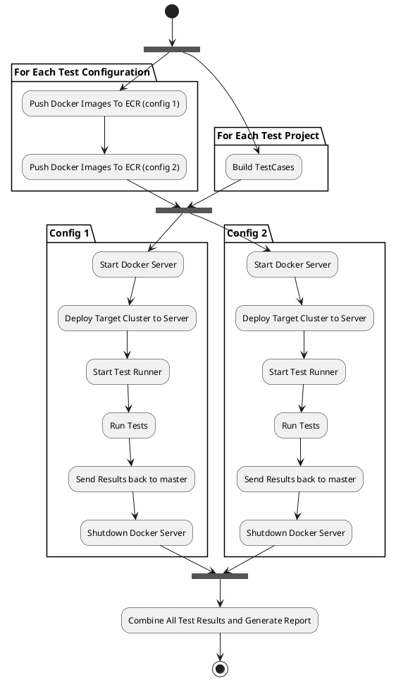

# AWS Test Environment DockerServer

::: header lang-en

| Product | AWS Automation   |
| ------- | ---------------- |
| Author  | Arwyn Hainsworth |
| Status  | 1.0              |

[[TOC]]

:::

## Overview

The Automation Test Environment is designed so that the developers can write and run the tests locally, then run the same tests remotely.

Due to the quantity of tests and the resource requirements when running them, the test environment is being moved to AWS.
However the images and deployment procedures, including local debugging should remain the same.

Since the source code and build environment of a number of projects is done on the local network, the primary flow controller needs to be able to access both the local network and the AWS environment. For this reason a Jenkins Master running on the local network will, with the assistance of both local and remote slaves control the Test Flow.

This specification describes the flow and behavior of the AWS Automation Test Environment and the controlling Jenkins Master.

## Goals and Non Goals

Goals
:   - Describe AWS Test Environment
        + Describe the images and resources used
    - Describe Jenkins Master behavior
        + Describe the Jobs used and their content
        + Describe the Jenkins Slaves used.

Non-Goals
:   - Describe how images are created

## Architectural Design

::: comparison plain

!!! info Description

    Jenkins Master
    :   - Controls both AWS and local slaves.
        - Has Access to AWS Public Network.

    Local Registry
    :   - This is where the docker images are put after build
        - Cannot be accessed from AWS

    Gerrit
    :   - Cannot be accessed from AWS.

    ECR
    :   - AWS Docker Registry. AWS can access here.

    DockerServer
    :   - EC2 Instance running Docker Server.
        - The target environment will load here.

    Test Runner
    :   - EC2 Instance controlled by jenkins.
        - Run test against docker server

    Control Slaves
    :   - EC2 Instance controlled by jenkins.
        - Can access internal AWS resource

    Fake Mail
    :   - EC2 Instance that accept all connection of port 25 (smtp)
        - Deletes all mail as it is received.

!!! info Test Environment

    ```plantuml
    @startuml

    !include <aws/common>
    !include <aws/General/AWSCloud/AWSCloud>
    !include <aws/Compute/AmazonEC2/instance/instance>
    !include <aws/Compute/AmazonECR/AmazonECR>
    !include <aws/Compute/AmazonVPC/AmazonVPC>
    !include <aws/Compute/AmazonEC2/instances/instances>

    rectangle localenv {
        node JenkinsMaster
        node Gerrit
        node LocalRegistry
        rectangle LocalJenkinsSlaves {
            node BuildSlave
        }
    }

    AWSCLOUD(aws) {
        AMAZONECR(ECR, "Test Account Docker Registry", component)
        AMAZONVPC(TestVPC, "Test VPC") {
            cloud PrivateNetwork {
                INSTANCES(DockerServer,"Docker Server(s)", node)
                INSTANCE(FakeMail,"Fake Mail Server", node)
            }
            cloud PublicNetwork {
                rectangle JenkinsSlaves {
                    INSTANCES(ControlSlave,"Control Slave(s)", node)
                    INSTANCES(TestRunner,"Test Runner(s)", node)
                }
            }
        }
    }

    JenkinsMaster --> LocalJenkinsSlaves : Controls
    JenkinsMaster --> JenkinsSlaves : Controls
    BuildSlave --> ECR : Has Access
    DockerServer --> ECR : Has Access
    DockerServer --> FakeMail
    BuildSlave --> Gerrit : Has Access
    BuildSlave --> LocalRegistry : Has Access
    PublicNetwork --> PrivateNetwork: Has Access
    JenkinsMaster --> PublicNetwork: Has Access
    TestRunner --> DockerServer : Run Tests Against
    ControlSlave --> DockerServer : Starts and Stops

    @enduml
    ```
:::

### Test Configuration

A test configuration is a collection of settings that define a target environment and a set of tests to run.

Each Test configuration must contain and may only contain 1 of each of the following:

1. A target cluster configuration (in the same format as the internal dev tools)
1. A test Project
1. A set of filters to apply to the test project

As a result, a test configuration is limited to a single project (or even a subset of a project).

### Test Job

A Test Job runs one of more Test Configurations. It can run them in sequence or in parallel, or in groups with a specified concurrency.

Each configuration will have its own target cluster, however the AWS Account and ECR will be shared.

A simplified flow described below. This is implemented with a Jenkins Pipeline job, with each task being performed by a separate Job. The jobs will be described below.



### Jenkins Jobs

#### Build TestCases

This job will build a test case project and publish the results as artifacts. These can be copied by the Jenkins Master to the test runner slave.

This job needs access to the source code and Nexus repositories.

#### Push to ECR

This job will push all used images by the configuration to ECR.

This job needs access to local docker repository and ECR

Publish the config to use in AWS

#### Start Docker Server

This job starts a docker server.

You should specify how many IPs the configuration needs and the instance type to used. Default is c5d.large with 10 IPs.

It uses CloudFormation to start the server and reports the instance-id back to the master.

#### AWS Deploy Cluster

This job deploys the target cluster to the Docker Server.

Needs access to the docker server instance and the instance-id to access. Also needs to cluster config to use.

This job will also register any IP with associated URL with Route53

#### Run Test Cases

This job will run the test cases against Docker Server.

It will actually run against the urls registered in route53.

This job will run in a test runner slave.

#### Shutdown Docker Server

Delete the docker server stack.

#### Combine Test Cases

Combine all test results and generate a report.

This job can be memory intensive.

### Implementation Details

#### Docker Server

The docker server cloudformation and script to start and stop it are provided in the `automation/jenkins/tools` repository in the `deploy/aws` directory.

The `deploy-aws-docker-server.sh` script should be used to start the server. This will use the `deploy-aws-docker-server.template.json` cloudformation json to create the instance and security group.

The cloudformation requires a subnet-id, an ami-id and a vpc-id. The script can auto-detect the vpc-id from the subnet-id.

The script will also wait for completion and output logs on failure.

Detailed usage of the script is available with the `-h` flag.

The `shutdown-aws-docker-server.sh` script will delete the stack.

Known Issues
:   1.  If you provide an invalid IAMProfile, the cloud formation will freeze (and timeout) without giving a reason.

        Make sure the IAMProfile is valid
    2.  The SSH Key Pair is validated, even if it is not used.

        Provide a valid key-pair even if debug mode is not enabled.

#### AWS vs Local Slaves

Both the AWS and Local Slaves are provided by Jenkins Clouds.

Each environment you need to launch slaves in needs a cloud defined.

The jobs then specify the label to used for the slave. A slave will be started in the cloud that provides the label.

This means each environment will need its own set of jobs.
In order to reduce maintenance cost. The logic of each job will be committed to the repository as a script and the job will simply execute it.

#### Test Flow Pipeline

TODO

