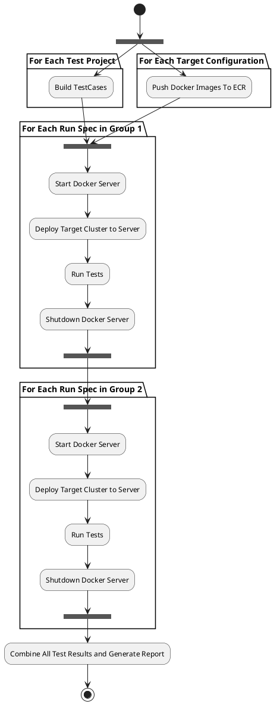

# AWS Test Environment - Running Tests

::: header lang-en

| Product | AWS Automation   |
| ------- | ---------------- |
| Author  | Arwyn Hainsworth |
| Status  | 1.0              |

[[TOC]]

:::

## Overview

Running Tests on the AWS environment involves multiple stages, some are run in sequence, others in parallel. Each step occurs in its own Jenkins Job with the overall flow controlled by a separate pipeline.



## Goals and Non Goals

Goals
:   - Describe AWS Test Flow and Behavior
    - Describe Test Runner Behaviour
    - Describe Runner Pipeline

Non-Goals
:   - Describe how images are created

## Detailed Design

### Test Configuration

A test configuration is a collection of settings that define a target environment and a set of tests to run.

Each Test configuration must contain and may only contain 1 of each of the following:

1. A target cluster configuration (in the same format as the internal dev tools)
1. A test build
1. A set of filters to apply to the test run
1. A server environment to run on

The test build is limited to a single project in a single repository, so a test configuration will represent a subset of tests for a specific test project.

### Test Runner

The test running will not use `dotnet test`. Instead it will use a separate tool that will run the native `NUnitLite` test runner.

The reason for this is as follows:

1. During original development of the project on DotNet Core SDK 1.0 this was the default behavior.
1. It is faster.
1. It has additional features that are not present in the new dotnet default runner
    1. The major one being the ability to use the bug marker to filter test cases.

The tool source can be found in the `automation/util/nunit-test-runner` gerrit repository.

It consists of a single source file: Program.cs. When run, it expects a single argument to be the absolute path to the testcase project DLL. All Dlls in the folder of the DLL will be made available to the assembly and the Nunit Runner class will be triggered to detect and run test cases that match given filters.

More details on NUnit TestRunner
: [https://github.com/nunit/docs/wiki/NUnitLite-Runner](https://github.com/nunit/docs/wiki/NUnitLite-Runner)

More detail on Test Filters
:   [https://github.com/nunit/docs/wiki/Test-Selection-Language](https://github.com/nunit/docs/wiki/Test-Selection-Language)

    The Porters Test Framework defines a `Bug` property with which bugs are marked when triaged. This is used during regression testing. Bug you can also use it when filtering tests.  
    E.G. `Bug=3344` will run all cases marked with Bug 3344.

The runner is configured as a dotnet tool and can be installed using `dotnet tool install`.

### DNS

The AWS Test Environment uses route53 as the DNS Server. The AWS Test Env defines a domain for use with the test environment and as part of the cluster deployment process uses cloudformation to register the URLS needed for the cluster in the domain with the corresponding IPs.

The cluster deployment tools already contain a method for URL/IP resolution. There are currently 2 methods.

1. The local environment `hosts` file. This is used in the local development environment.
1. A Dynamic DNS server that supports update commands. This is used in the manual test environment.

A new resolver was added for AWS Test Environment. The docker server instance-id should be provided as the `PDOCKER_RESOLVEGROUP`. The resolver follows the external resolver interface of the developments tools.

For each IP/URL needed, a Route53 A record will be created. The records are created in a single batch using a generated cloudformation stack named after the stack used to create the docker server ( -IPS is added to the end of the stack name).

This stack does not physically depend on the docker server stack, but it does not make sense to keep it around, so is deleted at the same time the server stack is deleted.

The `URLGROUP` used to build the URL prefix is the `ClusterName`.

The `ClusterName` is generated from the job name, the job id and the index of the run specification being tested.

### Grouping and Concurrency

The concurrency is specified as part of the test run environment. The array of test run configurations is split into groups of at most `concurrency` elements. Items in each group are executed in parallel with additional groups executed in serial. Order is preserved as much as possible.

E.G. If you provide a concurrency of 3 and 7 run configurations, they will be split into 3 groups: `[1, 2, 3]`, `[4, 5, 6]` and `[7]`.

### JSON Test Configuration

Since a large number of parameters are needed to control and specify a test run, the configuration is specified as a JSON file.

::: comparison plain

!!! summary Field Description

    title
    :   Descriptive text, will be show in build result.

    environment
    :   Object describing execution environment.  

    testParams
    :   Collection of named objects describing test runtime parameters.  

    buildParams
    :   Collection of named objects describing test build-time parameters.  

    tests
    :   Collection of named objects describing mappings of build-time, run-time parameters, along with run-time filters.

    targets
    :   Collection of named objects describing test target clusters.  

    servers
    :   Collection of named objects describing server environments to run target clusters on.  

    run
    :   Array of objects that represent the Test Configuration(s) to run.  

!!! info Root JSON

    ```json
    {
        "title": "<title>",
        "environment": {},
        "testParams": {
            "<testParamBlockName>": {}
        },
        "buildParams": {
            "<buildParamBlockName>": {}
        },
        "tests": {
            "<testBuildFilterMappingName>": {}
        },
        "targets": {
            "<targetName>": {}
        },
        "servers": {
            "<serverConfigName>": {}
        },
        "run": [
            {
                "target": "<targetName>",
                "tests": "<testBuildFilterMappingName>",
                "server": "<serverConfigName>"
            }
        ]
    }
    ```

:::

::: comparison plain

!!! summary `environment` field description
    Defines the parameters of the Jenkins execution Environment.

    concurrency
    :   The number of concurrent clusters to test.
        This is scoped to the current configuration execution and not to the account.

    *Label
    :   The jenkins labels to use to run the jobs.

    credentialsId
    :   The jenkins credentials ID of the AWS access/secret keys.

    *Job
    :   The Jenkins Jobs used to execute the actual task.  
        The defaults should work fine.

!!! info `environment` JSON example

    ```json
    {
        "concurrency": 6,
        "reportLabel": "aws-autotest-hrbc-report",
        "controlLabel": "aws-autotest-hrbc-control",
        "testRunnerLabel": "aws-autotest-hrbc-runner",
        "credentialsId": "AWS-AutoTest-HRBC",
        "testEnvName": "AutoTest",
        "buildJob": "Automation_Test_BuildTestCases",
        "prepareJob": "Automation_Docker_PrepareAWSCluster",
        "serverStartJob": "Automation_Deploy_DockerServer",
        "deployJob": "Automation_Deploy_DockerCluster",
        "testJob": "Automation_Test_RunTestCases",
        "serverStopJob": "Automation_Deploy_ServerShutdown",
        "buildToolsJob": "Automation_Build_BuildTools",
    }
    ```

:::

::: comparison plain

!!! summary `testParams` field description
    These are Key/Values you wish to be embedded in the `appsettings.json` runtime test configuration.

    The variables `${xxx}` present in the values are resolved before each test execution and contain the the `ClusterName` and all exported variables of the test environment cloudformation template.

!!! info `testParams` JSON example

    ```json
    {
      "BaseURI": "http://${ClusterName}-web.${DomainName}",
      "PrivateServer": "http://${ClusterName}-web.${DomainName}",
      "ServerURL": "http://${ClusterName}-api.${DomainName}",
      "PublicServer": "http://${ClusterName}-api.${DomainName}"
    }
    ```
:::


::: comparison plain

!!! summary `nunitParams` field description
    These are Key/Values you wish to be passed as TestParameters to NUnit.

!!! info `nunitParams` JSON example

    ```json
    {
      "Regression": "true",
      "Log": "failed"
    }
    ```
:::

::: comparison plain

!!! summary `buildParams` field description

    Parameters passed to the build testcases job.

    Repository, commit and project path, etc.

!!! info `buildParams` JSON example

    ```json
    {
      "Repo": "automation/test/public-api",
      "RefSpec": "",
      "SolutionPath": ".",
      "ProjectPath": "src",
      "TestProject": "PublicAPI",
      "Commit": "origin/master"
    }
    ```

:::

::: comparison plain

!!! summary `tests` field description

    filter
    :   The NUnit Test Filter

    buildParams
    :   name of the buildParams configuration to use.

    testParams
    :   name of the testParams configuration to use.

    nunitParams
    :   name of the nunitParams configuration to use.

!!! info `tests` JSON example

    ```json
    {
      "filter": "cat=MinimalVerification",
      "buildParams": "publicapi-origin/master",
      "testParams": "defaultPublicAPIParams",
      "nunitParams": "regressionMode"
    }
    ```

:::

::: comparison plain

!!! summary `targets` field description

    Define a target cluster. These are expected to be in a format understood by the dev env tools.

    compose
    :   Named collection of compose repositories.  
        Prefix the name when referencing them.  
        E.G. if the example, the cluster folder in the `hrbc` compose repository is access with `hrbc/clusters/...`.  
        This allows you to checkout and use multiple compose repositories in a single cluster configuration.

    vars
    :   Any additional environment variables to declare before cluster up.

    clusterFolder
    :   The directory used to define the cluster.  
        Don't forget to prefix with the compose folder.

!!! info `targets` JSON example

    ```json
    {
        "compose": {
            "hrbc": {
                "repo": "hrbc/docker/compose",
                "ref": "dev"
            }
        },
        "vars": {},
        "clusterFolder": "hrbc/clusters/hrbc/4-0-11",
        "clusterName": "publicapi"
    }
    ```
:::

::: comparison plain

!!! summary `servers` field description

    Server Configuration to run target clusters.

    type
    :   The instance type tp use for the docker server

    ips
    :   The number of available IPs needed.

!!! info `servers` JSON example

    ```json
    {
        "type": "c5.large",
        "ips": 9
    }
    ```

:::

::: comparison plain

!!! summary `run` field description

    target
    :   The target configuration to use

    tests
    :   The test mapping to use

    server
    :   The server configuration to use

!!! info `run` JSON example

    ```json
    {
        "target": "hrbc-4-0-11-publicapi",
        "tests": "PublicApi-Phase",
        "server": "defaultServerX",
    }
    ```

:::
